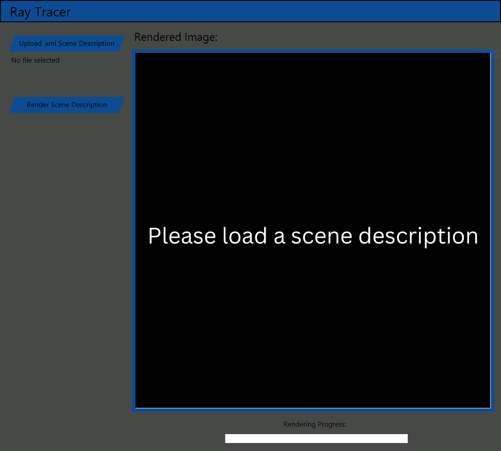
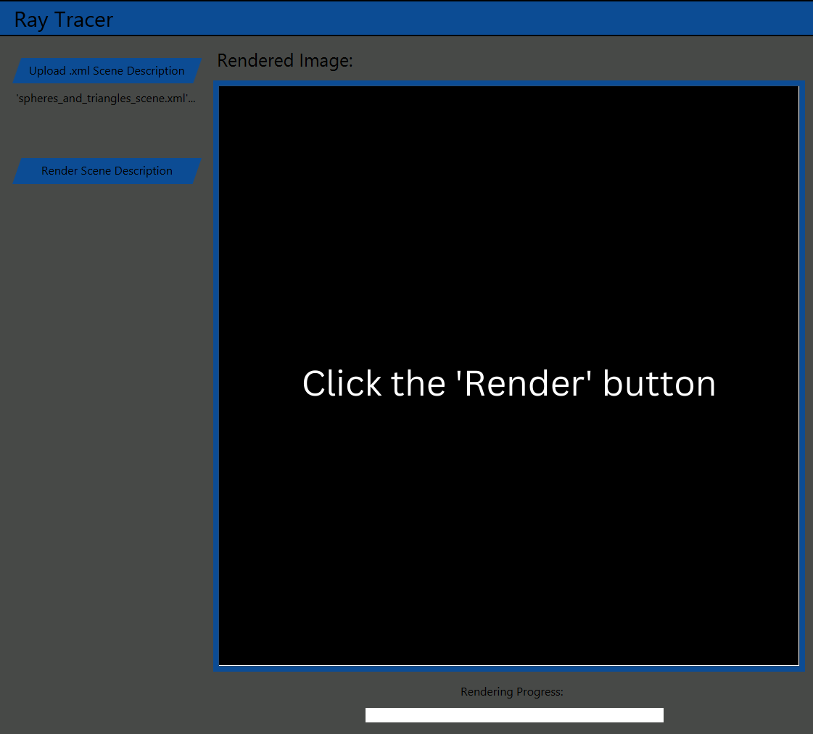
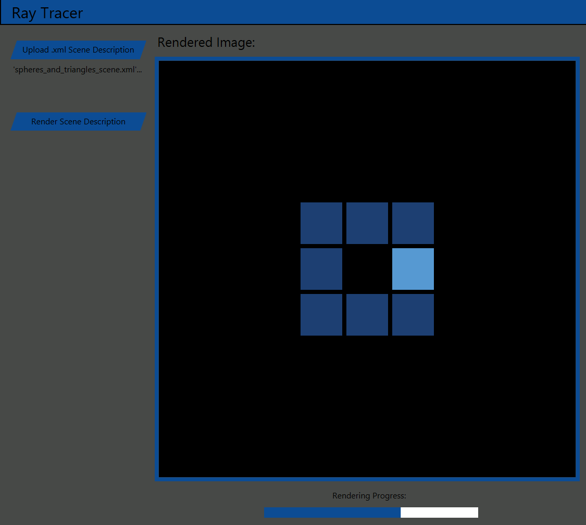
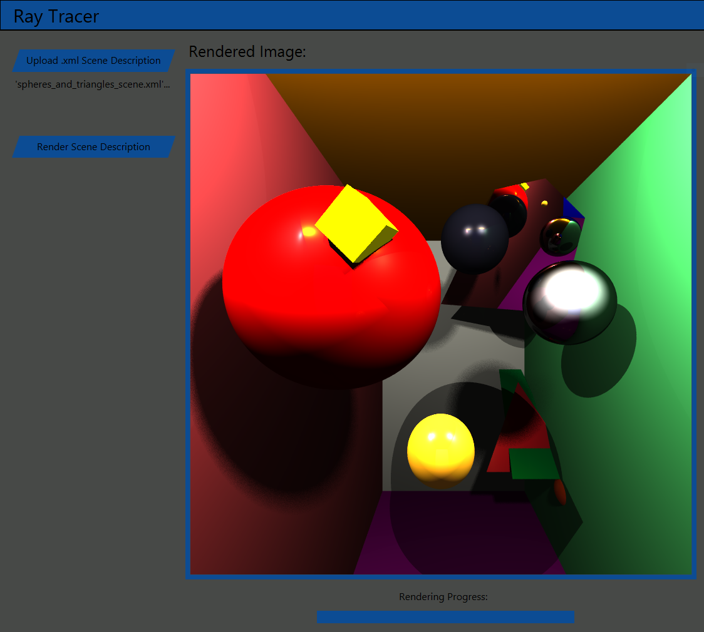

# Ray Tracer

This is an experimental ray tracing-based renderer for basic geometric primitives as well as arbitrary triangle meshes, written in Java.

Examples of rendered images:

<p align="center">
     
     
     
</p>

## UI

Currently, the simple UI supports loading an XML scene description, and rendering it into a digital image which is then displayed.

<p align="center">
     
     
     
     
</p>

## Scene Description Language

The **scene description language** that the renderer can understand is a subset of the XML. The scene description XML file must have the structure defined by the following set of rules:

- The root node is named ```elements```.
- The children of the root node are two nodes named ```shapes``` and ```lights```, respectively.
- The ```shapes``` node describes the shapes in the scene and contains any nonnegative integer number of nodes, each of which describes one shape.
- The ```lights``` node describes the lights in the scene and contains any nonnegative integer number of nodes, each of which describes one light.
- The nodes describing shapes and lights (children of ```shapes``` or ```lights```) must have structure as defined in their corresponding paragraph below.
- Points, vectors, colors, and shading coefficients (one for each of three RGB channels) are represented as ```(a,b,c)``` where ```a```, ```b```, and ```c``` are the three components.
- The three components in vector representations of colors must be integers in the range ```0``` to ```255``` inclusive, e.g. ```(255,12,7)```.

**Note**: do not add any spaces anywhere in the text values of XML nodes in the scene description unless it is explicitly specified. In other words, a 3D vector would be written as ```(3.2,1.3,0.005)``` without any spaces.

### Supported Shapes

Each supported shape has a set of defining attributes.

#### Sphere

A sphere is defined by its ```center```, ```radius```, and its diffuse ```color```.

```
<sphere>
     <center>(2,2,10)</center>
     <radius>3</radius>
     <color>(255,0,0)</color>
</sphere>
```

For instance, the ```material``` attribute is omitted here, so the ```material``` will be ```defaultNonReflective``` material.

#### Plane

A plane is defined by the ```normal``` vector to the plane, a ```point``` belonging to the plane, and its diffuse ```color```.

The ```normal``` need not necessarily be normalised to unit length.

```
<plane>
      <normal>(0,1,0)</normal>
      <point>(0,-20,0)</point>
      <color>(151,235,145)</color>
      <material>mirror</material>
</plane>
```

The ```material``` is explicitly defined here.

#### Triangle

A triangle is defined by its three vertices ```vertexA```, ```vertexB```, ```vertexC```, and its diffuse ```color```.

```
<triangle>
     <vertexA>(-8,3,40)</vertexA>
     <vertexB>(-6,-13,21)</vertexB>
     <vertexC>(-11,-13,21)</vertexC>
     <color>(0,165,80)</color>
</triangle>
```

If only these attributes are specified, vertex normals will be set to be equal to the unit normal to the surface of the triangle, and the triangle will be **flat shaded**: surface normals across the triangle will not be interpolated and the triangle will be shaded as it is, i.e. with a flat surface. Optionally, you can specify the vertex normals using attributes ```normalA```, ```normalB```, ```normalC```, in which case the surface normals will be interpolated for this triangle, and it will be **smooth shaded**, meaning that the triangle is shaded so that it looks like the surface between its three vertices is continuously curved.

```
<triangle>
     <vertexA>(0,2,25)</vertexA>
     <vertexB>(-18,0,18)</vertexB>
     <vertexC>(-5,12,17)</vertexC>
     <normalA>(-0.2,0.1,1)</normalA>
     <normalB>(0.5,0.2,0.3)</normalB>
     <normalC>(0,0,1)</normalC>
     <color>(255,255,255)</color>
     <material>mirror</material>
</triangle>
```

The vertices must be specified in counter-clockwise orientation. If the vertex normals are specified, all three have to be specified for the **smooth shading** to be activated. The vertex normal vectors need not necessarily be normalised to unit length.

#### Triangle Mesh

A triangle mesh is defined by the relative path from the project root directory or absolute path to the Wavefront .obj file describing its vertices, normals and triangles, i.e. the ```path-to-obj-file``` attribute, and its diffuse ```color```.

```
<triangle-mesh>
     <path-to-obj-file>src/main/resources/meshes/pawnFlatShadedWithNormals.obj</path-to-obj-file>
     <color>(218,165,32)</color>
     <material>gold</material>
</triangle-mesh>
```

The .obj file must contain the vertices of the mesh, the vertex normals, and the indices of vertices that form faces (triangles). The following is an example of a Wavefront .obj file describing a cube:

```
# vertices
v -1.000000 -1.000000 -1.000000
v 1.000000 -1.000000 -1.000000
v 1.000000 1.000000 -1.000000
v -1.000000 1.000000 -1.000000
v -1.000000 -1.000000 1.000000
v 1.000000 -1.000000 1.000000
v 1.000000 1.000000 1.000000
v -1.000000 1.000000 1.000000

# vertex normals
vn 1.000000 -1.000000 -1.000000
vn 1.000000 1.000000 -1.000000
vn -1.000000 1.000000 -1.000000
vn -1.000000 -1.000000 1.000000
vn 1.000000 -1.000000 1.000000
vn 1.000000 1.000000 1.000000
vn -1.000000 1.000000 1.000000

# indices of vertices that form faces (triangles), and vertex normals
f 3//3 2//2 1//1
f 4//4 3//3 1//1
f 5//5 6//6 7//7
f 5//5 7//7 8//8
f 2//2 3//3 6//6
f 2//2 6//6 5//5
f 4//4 3//3 8//8
f 4//4 7//7 8//8
f 1//1 2//2 5//5
f 1//1 5//5 8//8
f 2//2 3//3 6//6
f 6//6 3//3 7//7
```

Triangle meshes can have an optinal attribute ```model-transform``` - this is because the .obj file can only define the mesh at one place in 3D space, usually centered at origin with normalised height and width, so we need modelling transformations to position meshes at the wanted place in the scene. The ```model-transform``` attribute is the only non-leaf attribute - its children are XML nodes that describe modelling transformations - ```scale```, ```rotateX```, ```rotateY```, ```rotateZ```, and ```translate```.

The ```scale``` transform takes three scaling coefficients, one for each axis, as a 3D vector, and scales the mesh about the origin.

The ```rotateX```, ```rotateY```, and ```rotateX``` transforms all take one real number representing the angle in degrees by which to rotate the mesh about the given axis. Rotations are counter-clockwise, and negative angles represent clockwise rotations.

```
<triangle-mesh>
     <path-to-obj-file>src/main/resources/meshes/pawnFlatShadedWithNormals.obj</path-to-obj-file>
     <model-transform>
         <scale>(2.5,2.5,2.5)</scale>
         <translate>(1.5,-3,15)</translate>
     </model-transform>
     <color>(218,165,32)</color>
     <material>gold</material>
</triangle-mesh>
```

The modelling transformations are applied to the mesh in the same order as they are listed in the ```model-transform``` attribute, so most of the time you should first ```scale```, the ```rotate(X, Y, or Z)```, and then ```translate```.

Note that you can choose whether your mesh is **flat shaded** (no normal interpolation) or **smooth shaded** (yes normal interpolation) by choosing appropriate vertex normals in the .obj description of your mesh.

The easiest way to create complicated triangle meshes is probably to use a tool such as [Blender](https://www.blender.org/).

#### Box

A box is a cuboid with edges parallel to the axes, defined by the minimum and maximum values of the three components, i.e. attributes ```minX```, ```maxX```, ```minY```, ```maxY```, ```minZ```, and ```maxZ```, as well as its diffuse ```color```.

```
<box-mesh>
      <minX>0</minX>
      <maxX>1</maxX>
      <minY>0</minY>
      <maxY>1</maxY>
      <minZ>0</minZ>
      <maxZ>1</maxZ>
      <model-transform>
            <scale>(1,1,1)</scale>
            <translate>(1.5,-1.5,4.8)</translate>
            <rotateX>-20</rotateX>
            <rotateZ>45</rotateZ>
            <rotateY>10</rotateY>
            <translate>(0,0,0.2)</translate>
      </model-transform>
      <color>(255,255,0)</color>
 </box-mesh>
```

Note that since the box is implemented as a triangle mesh consisting of 12 triangles, it can have the ```model-transform``` attribute as well.

### Material

Besides the defining attributes, each shape can have an optional ```material``` attribute which defines the properties (ambient, diffuse, and specular shading coefficients, Phong's roughness coefficient, and the reflection coefficient) of the material which the surface of the shape is made out of. The material is either defined by specifying one of the names from the following list:

```
defaultReflectiveMaterial, defaultNonReflectiveMaterial

metal, glass, mirror, plastic

obisidan, ruby

brass, gold, silver, copper

blackPlastic, redPlastic, cyanPlastic

greenRubber, redRubber, yellowRubber

concrete
```

like this:

```
<material>glass</material>
```

or by explicitly defining the values of each material property in the following format:

```
<material>((ambient_coefficient_red, ambient_coefficient_green, ambient_coefficient_blue),
           (diffuse_coefficient_red, diffuse_coefficient_green, diffuse_coefficient_blue),
           (specular_coefficient_red, specular_coefficient_green, specular_coefficient_blue),
            phong_roughness_coefficient, reflection_coefficient)</material>
```

The ambient, diffuse and specular coefficients define the intensity of their respective components of illumination in the Phong's shading model, Phong's roughness coefficient defines the magnitude of the shininess effect in specular shading, and the reflection coefficient defines how much of the incoming light is reflected from the material.

For example:

```
<material>((0.19225,0.19225, 0.19225),(0.50754, 0.50754, 0.50754),(0.508273,0.508273,0.508273),0.4,0.05)</material>
```
In case the ```material``` attribute is left out in the shape's XML node, ```defaultNonReflective``` material is set.


### Lights

Lights can be point lights and spherical lights.

#### Point Lights

A point light is defined by its ```position```, specular ```color``` (color of the light source), and its ```intensity```.

```
<point-light>
        <position>(-10,10,-5)</position>
        <color>(255,255,0)</color>
        <intensity>0.6</intensity>
 </point-light>
```

 The ```intensity``` of the light source must be a positive real number.

 Point lights generate **sharp shadows**.

#### Spherical Lights

A spherical light is defined by its ```position``` (center of the sphere), specular ```color```, ```intensity```, and its ```radius```.

```
<sphere-light>
        <position>(-12,15,0)</position>
        <color>(255,255,255)</color>
        <intensity>1</intensity>
        <radius>0.5</radius>
 </sphere-light>
```

 The ```radius``` of the spherical light source must be a positive real number.

 Spherical lights are used for rendering **soft shadows** by shooting shadow rays to random points on the surface of the sphere.

 

### Example of a Valid Scene Description

The following is an example of an entire scene description.

```
<elements>
   <shapes>
       <sphere>
           <center>(2,2,10)</center>
           <radius>3</radius>
           <color>(255,0,0)</color>
       </sphere>

       <plane>
           <normal>(0,1,0)</normal>
           <point>(0,-20,0)</point>
           <color>(151,235,145)</color>
       </plane>

       <triangle>
           <vertexA>(-8,3,40)</vertexA>
           <vertexB>(-6,-13,21)</vertexB>
           <vertexC>(-11,-13,21)</vertexC>
           <color>(0,165,80)</color>
           <material>green-rubber</material>
       </triangle>

       <triangle-mesh>
           <path-to-obj-file>src/main/resources/meshes/pawnFlatShadedWithNormals.obj</path-to-obj-file>
           <model-transform>
               <scale>(2.5,2.5,2.5)</scale>
               <translate>(1.5,-3,15)</translate>
           </model-transform>
           <color>(218,165,32)</color>
           <material>gold</material>
      </triangle-mesh>

      <box-mesh>
           <minX>0</minX>
           <maxX>1</maxX>
           <minY>0</minY>
           <maxY>1</maxY>
           <minZ>0</minZ>
           <maxZ>1</maxZ>
           <model-transform>
               <scale>(1,1,1)</scale>
               <translate>(1.5,-1.5,4.8)</translate>
               <rotateX>-20</rotateX>
               <rotateZ>45</rotateZ>
               <rotateY>10</rotateY>
               <translate>(0,0,0.2)</translate>
           </model-transform>
           <color>(255,255,0)</color>
       </box-mesh>
   </shapes>

   <lights>
       <point-light>
           <position>(-10,10,-5)</position>
           <color>(255,255,0)</color>
           <intensity>0.6</intensity>
       </point-light>

       <sphere-light>
           <position>(-12,15,0)</position>
           <color>(255,255,255)</color>
           <intensity>1</intensity>
           <radius>0.5</radius>
       </sphere-light>
   </lights>
</elements>
```


## Instructions for Running

To run the project, first clone the repository locally: 

```
git clone https://github.com/losmi247/ray-tracer
```

Open the project in an IDE to make sure _Maven_ imports the dependencies from the ```pom.xml``` file - try running ```mvn clean install``` if it doesn't.
Finally, run the following command from the project root directory to start the _JavaFX_ app using _Maven_:

```
mvn javafx:run -f "./pom.xml"
```
